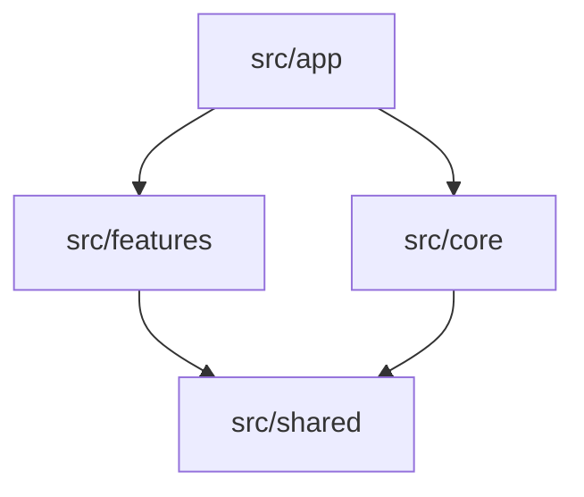

# ilanx Proje Mimari Dokümantasyonu

Bu belge, `ilanx` fotoğraf editörü platformunun mimari prensiplerini, klasör hiyerarşisini ve veri akışını açıklar.

## Mimari Prensipler

Proje, dikey iş/domain sınırlarına bölünmüş **Feature-Based Domain-Driven Design (DDD)** yaklaşımı ile tasarlanmıştır. Bu sayede kod tabanı modüler, bağımsız ölçeklenebilir ve AI-destekli geliştirmeye (AI-assisted development) son derece uygundur.

## Klasör Yapısı

*   `src/app/`: Next.js App Router sayfaları, global yönlendirme, kök şablonlar ve ana CSS dosyası.
*   `src/core/`: Proje genelindeki çekirdek servisler ve altyapı katmanları.
    *   `providers/`: Tema vb. global React sağlayıcıları.
    *   `components/`: ErrorBoundary gibi kritik altyapı bileşenleri.
    *   `utils/`: Telemetri ve loglama araçları.
*   `src/shared/`: Hiçbir özelliğe doğrudan bağımlı olmayan, tamamen izole ortak katman.
    *   `components/ui/`: Butonlar, girdiler vb. atomik arayüz elemanları (shadcn tabanlı).
    *   `types/`: Proje genelinde kullanılan konsolide edilmiş TypeScript arayüzleri.
*   `src/features/`: İş/Domain dikey paketleri.
    *   `landing/`: Tanıtım ve karşılama sayfası bileşenleri.
    *   `animations/`: Neon, saber ve 3D efekt çizim motorları.
    *   `export/`: PDF, PNG ve video dönüştürücü motorlar.
    *   `editor/`: Görsel işaretleme editörü ana domaini.
        *   `store/`: Zustand durum yönetimi.
        *   `hooks/`: Canvas araçları ve durum senkronizasyon kancaları.
        *   `utils/`: Fabric.js API eklentileri, geçmiş yöneticisi (history) ve şekil fabrikaları.

## Veri Akışı ve Senkronizasyon

1.  **Zustand (React State):** Editörün araç seçimi, çizim ayarları (renk, opaklık) ve nesne türü gibi durumlar Zustand store üzerinden reaktif olarak yönetilir.
2.  **Fabric.js (Canvas Canvas):** Görsel nesneler, çizim yolları ve koordinat sistemleri Fabric.js canvas üzerinde tutulur.
3.  **useCanvasSync (Çift Yönlü Köprü):** React durum değişiklikleri canvas nesnelerine yansıtılırken, canvas üzerindeki taşıma/boyutlandırma/seçim olayları da Zustand store'a geri beslenir.
4.  **Autosave & LocalStorage:** Canvas'taki her tarihsel değişim (saveHistory) otomatik olarak JSON formatında lokal hafızaya yedeklenir.
